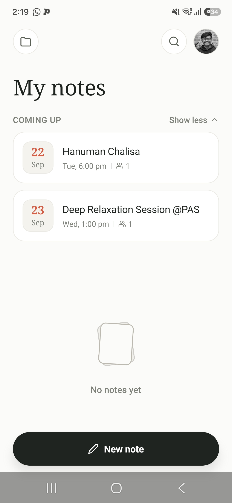
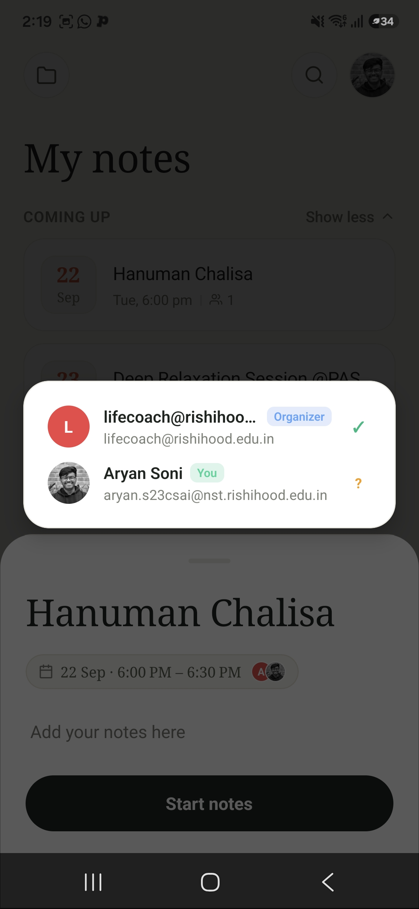
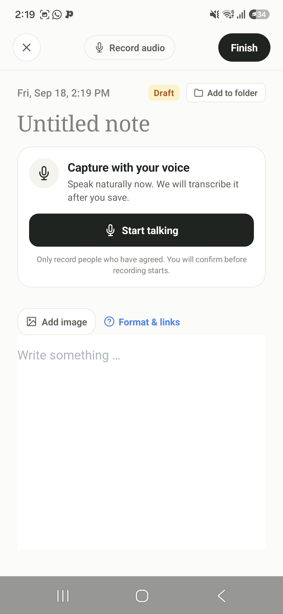
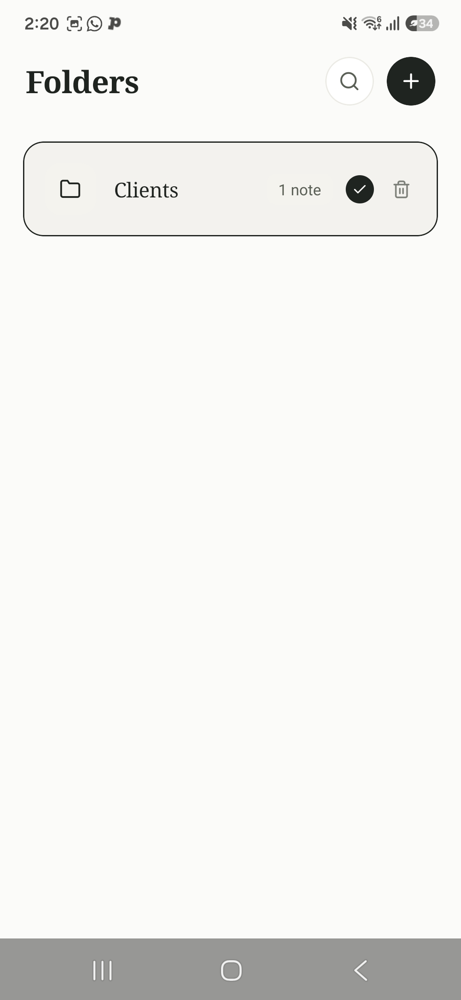

# Slate

> **Clean, blank, and ready for thoughts.**

Slate is an AI-powered meeting companion for professionals. It syncs with your Google Calendar, surfaces a pre-meeting dossier for every event, records live audio during meetings, and transcribes conversations in the background — all surfaced in a focused, distraction-free mobile experience.

---

## ✨ Features

### 📅 Agenda & Calendar Sync
- Pulls today's Google Calendar events in real time via OAuth 2.0 + silent token renewal
- Event cards show attendees, time, location, and join links
- Pull-to-refresh with animated loading states

### 📋 Meeting Dossier
- Pre-meeting brief for each calendar event
- Add personal action items before entering the room
- Attendee list with avatars and email details

### 🎙️ Live Meeting Copilot
- One-tap audio recording during a meeting
- Real-time waveform visualisation
- Rich-text note editor (powered by **TenTap**) with live link detection and auto-formatting
- Attach images from camera roll
- Notes are saved locally first, then synced to Supabase in the background

### 🗒️ Notes & Folders
- All notes persisted locally (Zustand + AsyncStorage) and in Supabase
- Offline-first: writes are queued and flushed on reconnect
- Folder organisation with drag-and-assign UI
- Draft detection — blank notes are never cluttered in your feed

### 🔊 Async Audio Transcription (Background Worker)
- Uploaded audio is processed by a dedicated Node.js worker
- Deepgram Nova-3 model with speaker diarisation and smart formatting
- Transcript segments stored per-note; summary block generated automatically

### 🔐 Auth
- Google Sign-In via Expo `expo-auth-session`
- JWT verification on the server; sessions stored in Supabase
- Automatic silent token refresh — no mid-meeting logouts

### 🌗 Theming
- System-aware dark / light mode
- Custom design token system (`colors`, `fontFamilies`, `radius`, `space`)

---

## 📸 Screenshots

| My Notes | Attendees | Live Copilot | Folders |
|:---:|:---:|:---:|:---:|
|  |  |  |  |
| Calendar feed with upcoming events | Per-meeting attendee list & RSVP status | Voice capture + rich-text note editor | Folder management for notes |

---

## 🏗️ Architecture

```
slate/
├── mobile/          # React Native (Expo) app
│   ├── src/
│   │   ├── features/
│   │   │   ├── agenda/      # Calendar event cards, hooks, attendee modal
│   │   │   └── notes/       # NoteCard, FolderPickerModal, FoldersModal
│   │   ├── screens/
│   │   │   ├── AgendaScreen.tsx         # Today's calendar feed
│   │   │   ├── CommandCenterScreen.tsx  # Today's Desk — next meeting + Quick Jots
│   │   │   ├── DossierScreen.tsx        # Pre-meeting brief
│   │   │   ├── LiveCopilotScreen.tsx    # In-meeting recorder + note editor
│   │   │   └── ProfileScreen.tsx        # User profile & settings
│   │   ├── store/
│   │   │   ├── useNoteStore.ts          # Zustand note state (offline-first)
│   │   │   ├── useFolderStore.ts        # Zustand folder state
│   │   │   └── useMeetingStore.ts       # Active meeting session
│   │   ├── services/
│   │   │   ├── api.ts              # Calendar API calls
│   │   │   ├── auth.ts             # Google OAuth helpers
│   │   │   ├── noteSync.ts         # Supabase CRUD + outbox queue
│   │   │   └── meetingMedia.ts     # Audio upload + transcription queue
│   │   └── context/
│   │       ├── AuthContext.tsx
│   │       └── ThemeContext.tsx
│
├── server/          # Node.js / Express backend
│   └── src/
│       ├── server.ts        # Express app, routes, public pages
│       ├── worker.ts        # Background transcription poller (Deepgram)
│       ├── routes/          # API route handlers
│       ├── controllers/     # Business logic
│       ├── services/        # Supabase admin client, logger
│       └── pages.ts         # Home, Privacy, Terms HTML (Google OAuth verification)
│
└── supabase/
    └── migrations/          # Database schema migrations
```

---

## 🛠️ Tech Stack

| Layer | Technology |
|---|---|
| Mobile | React Native 0.86 + Expo 57 |
| UI Animations | React Native Reanimated 4 |
| Rich Text Editor | TenTap (`@10play/tentap-editor`) |
| State Management | Zustand 5 with AsyncStorage persistence |
| Auth | Google OAuth 2.0 via `expo-auth-session` |
| Backend | Node.js + Express + TypeScript |
| Database | Supabase (PostgreSQL) |
| Storage | Supabase Storage (audio blobs) |
| Transcription | Deepgram Nova-3 (speaker diarisation) |
| Calendar | Google Calendar API v3 |
| Deployment | Railway / Render (server), EAS Build (mobile) |

---

## 🚀 Getting Started

### Prerequisites
- Node.js 20+
- Expo CLI (`npm i -g expo-cli`)
- A Supabase project
- Google Cloud project with **Calendar API** + **OAuth 2.0** credentials
- (Optional) Deepgram API key for transcription

### 1 — Clone

```bash
git clone https://github.com/Aryan2vb/slate.git
cd slate
```

### 2 — Mobile setup

```bash
cd mobile
cp .env.example .env   # fill in your keys
npm install
npm start              # opens Expo Go / dev client
```

Key `.env` variables:

```env
EXPO_PUBLIC_SUPABASE_URL=
EXPO_PUBLIC_SUPABASE_ANON_KEY=
EXPO_PUBLIC_AUTH_SERVER_URL=
EXPO_PUBLIC_GOOGLE_CLIENT_ID_ANDROID=
EXPO_PUBLIC_GOOGLE_CLIENT_ID_WEB=
```

### 3 — Server setup

```bash
cd server
cp .env.example .env   # fill in your keys
npm install
npm run dev            # http://localhost:3001
```

Key `.env` variables:

```env
SUPABASE_URL=
SUPABASE_SERVICE_ROLE_KEY=
GOOGLE_CLIENT_ID=
GOOGLE_CLIENT_SECRET=
JWT_SECRET=
DEEPGRAM_API_KEY=
```

### 4 — Run the transcription worker (optional)

```bash
cd server
npm run worker
```

### 5 — Local dev with Docker

```bash
docker compose up      # spins up server + worker together
```

---

## 🗄️ Database

Supabase migrations live in `supabase/migrations/`. Apply them in order via the Supabase CLI or the dashboard SQL editor.

Core tables:
- `notes` — user notes with body, rich content, folder assignment, and meeting context
- `folders` — note collections per user
- `artifacts` — uploaded audio blobs (reference only; deleted after transcription)
- `processing_jobs` — transcription job queue with status & retry tracking
- `transcript_segments` — per-note diarised transcript rows
- `note_blocks` — structured blocks (summary, transcript) attached to notes

---

## 📦 Deployment

### Server → Railway / Render
Both `railway.json` and `render.yaml` are included. Push to the connected branch and the platform will build and deploy automatically.

### Mobile → EAS Build
```bash
cd mobile
eas build --profile preview --platform android
```

`eas.json` includes `preview` (APK) and `production` (AAB) profiles.

---

## 🔍 What I Built

As the sole developer on this project, I designed and shipped:

- **End-to-end Google OAuth flow** with silent token refresh and JWT auth server
- **Offline-first note sync** — notes write locally immediately, then flush to Supabase; a pending outbox retries on reconnect
- **Live meeting recording pipeline** — mic capture → Supabase Storage upload → background worker → Deepgram → structured transcript stored per-note
- **Rich-text note editor** with real-time URL detection, link-to-display conversion, and image attachments
- **Folder system** with drag-to-assign and draft filtering
- **Google Calendar integration** with automatic refresh, attendee rendering, and join-link detection
- **Docker Compose dev environment** to run server + worker together locally

---

## 📄 License

Private repository — all rights reserved.
